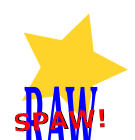

# Raw-Spaw!

C sharp implementation of this [python script](https://github.com/bohdanbobrowski/python_toolbox?tab=readme-ov-file#move_not_starred).

## Usage
```bash
rawspaw [-h] [-d] [-p PICTURE_EXTENSION] [-r RAW_EXTENSION] [-t TARGET]
Move raw files for jpegs that are not starred to subfolder. Requires exiftool.
    options:
-h, --help            show this help message and exit
-d, --dry-run         Dry run.
-p PICTURE_EXTENSION, --picture_extension PICTURE_EXTENSION
    Picture file extension (by default JPG).
-r RAW_EXTENSION, --raw_extension RAW_EXTENSION
    RAW file extension (by default DNG).
-t TARGET, --target TARGET
    Target path (by default creates sub folder with the same name as current one).
```

## Roadmap
- [X] Listing RAW files in folder
- [X] Creating subfolder if not exists
- [X] Reading EXIF ratings
- [X] Filtering not starred files
- [X] Moving RAW files to subfolder
- [X] Dry run option
- [X] Release as one exe file
- [X] Set release version number and print it in console
- [ ] Add commandline parser ([CommandLineUtils](https://github.com/natemcmaster/CommandLineUtils), [commandline](https://github.com/commandlineparser/commandline)...?) 
- [ ] Customizable picture and raw extensions
- [ ] Customizable target path
- [ ] Unit tests?
- [ ] Windows installer :-)
- [ ] Linux support?
- [ ] MacOS support?

## License
MIT License
