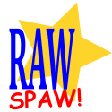

# Raw-Spaw!

C sharp implementation of this [python script](https://github.com/bohdanbobrowski/python_toolbox?tab=readme-ov-file#move_not_starred).

It helps to minimize size of images folder, by moving RAW's for not ranked and ranked less than 1 star JPEG's to subfolder. 

## Usage

```bash
RawSpaw 0.3.0+db5455ea9991e81265d50e8c6533a45d403ded33
Copyright (C) 2025 Bohdan Bobrowski

  -d, --dry-run              (Default: false) Dry run.

  -p, --picture-extension    (Default: JPG) Picture file extension.

  -r, --raw-extension        (Default: DNG) RAW file extension.

  -t, --target               (Default: .) Target path.

  --help                     Display this help screen.

  --version                  Display version information.
```

## Libraries used

1. [CommandLine](https://github.com/commandlineparser/commandline)
2. [MetadataExtractor](https://github.com/drewnoakes/metadata-extractor-dotnet)
3. [TagLib](https://github.com/mono/taglib-sharp) - in cases where MetadataExtractor fails (more testing needed)

## Roadmap
- [X] Listing RAW files in folder
- [X] Creating subfolder if not exists
- [X] Reading EXIF ratings
- [X] Filtering not starred files
- [X] Moving RAW files to subfolder
- [X] Dry run option
- [X] Release as one exe file
- [X] Set release version number and print it in console
- [X] Add commandline parser
- [X] Customizable picture and raw extensions
- [X] Customizable target path
- [ ] Customize help text of CommandLine parser
- [ ] Automatic tests
- [ ] Windows installer
- [ ] Linux support and package
- [ ] MacOS support?

## License
MIT License
